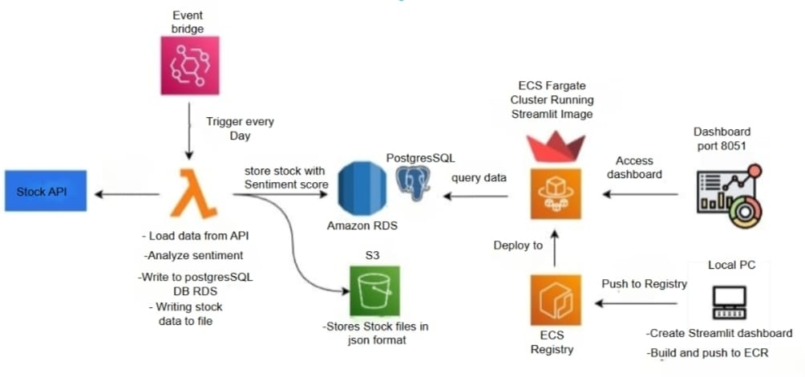

# 📊 Stock Sentiment Analysis

An end-to-end cloud-native pipeline that collects stock-related data via a public API, performs sentiment analysis, and presents the insights in an interactive dashboard built using Streamlit. The entire system is deployed on AWS using serverless and containerized services for scalability and automation.

---

## 🧠 Project Overview

This architecture is designed to automatically fetch stock-related data daily, analyze sentiment, store the results, and provide a live dashboard for monitoring and decision-making.

### 🔁 Pipeline Workflow:

1. **Trigger (EventBridge):**
   - Scheduled to run **daily**
   - Invokes an AWS Lambda function

2. **Processing (AWS Lambda):**
   - Fetches data from a **Stock API**
   - Performs **sentiment analysis**
   - Stores:
     - Processed sentiment data → **Amazon RDS (PostgreSQL)**
     - Raw stock data in JSON format → **Amazon S3**

3. **Data Storage:**
   - **Amazon RDS:** Structured data with sentiment scores
   - **Amazon S3:** Backup of raw stock API responses

4. **Dashboard Deployment:**
   - Dashboard developed locally using **Streamlit**
   - Containerized with **Docker**
   - Image pushed to **Amazon ECR**
   - Deployed to **Amazon ECS Fargate**
   - Accessed via browser on **port 8051**

---

## 🗺️ Architecture Diagram

---
## 📷 Dashboard Preview

## 🚀 Technologies Used

| Technology        | Purpose                              |
|-------------------|---------------------------------------|
| AWS Lambda        | Serverless stock processing logic     |
| AWS EventBridge   | Daily trigger scheduler               |
| Amazon RDS (PostgreSQL) | Structured data store            |
| Amazon S3         | Raw JSON backup of stock data         |
| Amazon ECS Fargate| Hosting the Streamlit dashboard       |
| Amazon ECR        | Docker image registry                 |
| Streamlit         | Web-based interactive dashboard       |
| Docker            | Containerization of the dashboard     |
| Python            | Primary language for Lambda + frontend|

---

## 📊 Dashboard Highlights

- Built using **Streamlit** and served from ECS Fargate
- Displays processed sentiment and stock data
- Supports real-time updates based on scheduled Lambda runs
- Accessible at: `http://<your-ecs-ip>:8051`
